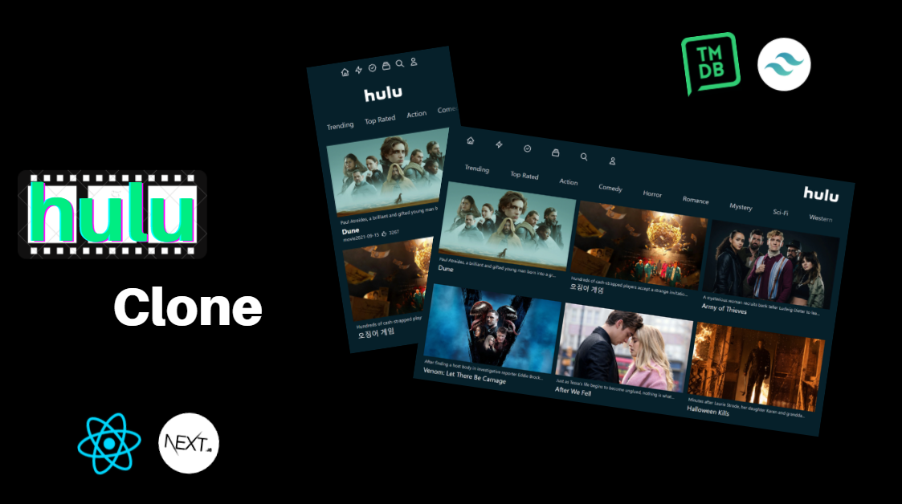

# Hulu Clone

This application is a replica of [Hulu](https://www.hulu.com/welcome?orig_referrer=https%3A%2F%2Fwww.google.com%2F) which is majority-owned by the [Walt Design Company](https://en.wikipedia.org/wiki/The_Walt_Disney_Company). This clone is built using Javascript frameworks like React, and Next and a CSS utility framework called TailwindCSS. The [Movie Database (TMDB)](https://www.themoviedb.org/) API is a community-built movie and TV database that is used to systematically retrieve details about movies, TV shows/seasons, actors, and more. The API is offered by TMDB for free, and one can obtain an API key by signing into their TMDB account.

- For more information regarding React, visit [https://react.dev/](https://react.dev/)
- For more information regarding Next, visit [https://nextjs.org/](https://nextjs.org/)
- For more information regarding TailwindCSS, visit [https://tailwindcss.com/](https://tailwindcss.com/)

## Live Website

https://hulu-clone-tmdb.vercel.app/

## Features

- **Responsive Web**: Responsive Web Design using React, Next & TailwindCSS.
- **Thumbnail Display**: Displays a selection of TV and Movie data, sorted by genre, retrieved, and shown in the browser.
- **Server-Side Rendering**: Data is processed and rendered to the webpage on the server itself, rather than in the browser. 

## Screenshots



## Table of Contents

- [Installation](#installation)
- [Usage](#usage)
  
## Installation

Follow these steps to install and run the project on your local machine:

### Prerequisites

Before you begin, ensure you have met the following requirements:

- **Node.js**: [Install Node.js](https://nodejs.org/)
- **npm (Node Package Manager)**: Included with Node.js

### Clone the Repository

1. Clone this repository to your local machine using the following command:

   ```bash
   git clone https://github.com/Sadhvi10/instagram-clone.git

### Start the development server

2. Install npm and start the development server (localhost:3000) using the following command:

   ```bash
   npm i && npm run start

## Usage

The usage of a Hulu clone that fetches data from the TMDB API and utilizes server-side rendering can be understood from the following points:

- **Content Display**: The clone can showcase a vast array of movies, TV shows, and other multimedia content sourced directly from the TMDB database.
- **Real-time Data**: With the TMDB API, the clone is equipped to display real-time information about movies and TV shows, ensuring users see the latest data.
- **Enhanced Performance**: Server-side rendering ensures faster initial page load times, offering users a snappier experience, especially for content-rich pages.
- **SEO Optimization**: SSR improves the site's search engine optimization. Since search engines receive fully rendered pages, it can index the site more effectively, beneficial for attracting organic traffic.
- **Categorized Viewing**: Users can browse content based on genres, popularity, release dates, and other categories, providing a more organized and tailored viewing experience.
- **Improved User Experience**: The combination of real-time data fetching and server-side rendering means users get a seamless browsing experience without long loading times or stale data.
- **Responsive Design**: Like Hulu, the clone can be designed to be responsive, ensuring a consistent user experience across various device types and screen sizes.


